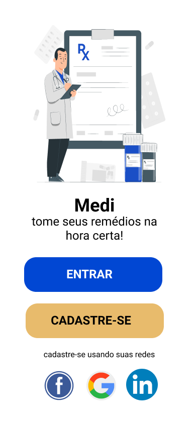
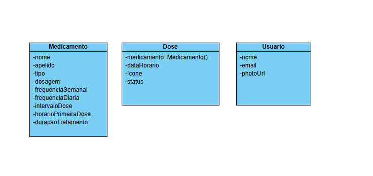
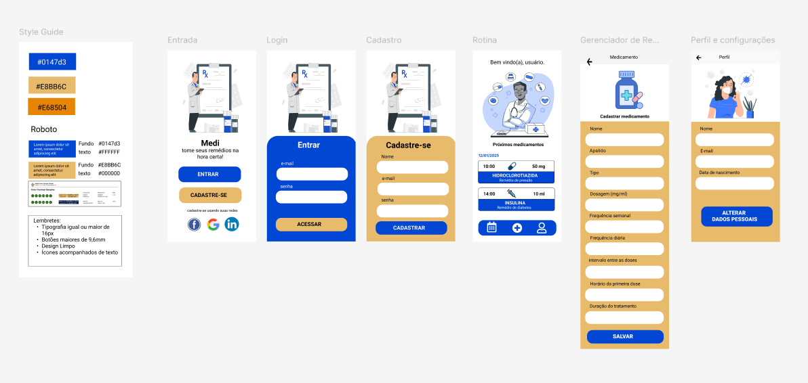

# Aplicativo medi - Controle de Medicamentos

## Projeto da disciplina

### Curso: 
* Pós Graduação em Desenvolvimento de aplicativos móveis - PUCPR

### Disciplinas: 
* Desenvolvimento Híbrido de Aplicativos
  

## Ferramentas
As seguintes ferramentas foram usadas na construção do projeto:

### 👉 **_Mobile_**

- Flutter
- SQFLite

### 👉 **_Desenvolvimento Geral_**

- Editor:
  - Android Studio
- Prototipagem:
  - Figma
- Reuniões:
  - Teams
- Diagramas:
  - VisualParadigm

## Introdução

Este projeto possui o objetivo principal **implementar um aplicativo de gerenciamento de medicamentos**.  

Com os objetivos gerais de controlar medicamentos e lembrar usuários sobre os horários da medicação.

## Análise técnica

### Descrição do ambiente técnico

O sistema é composto por um app desenvolvido em flutter e disponibilizado hibridamente para Android e IOS.
A persistência local é realizada por meio de banco de dados relacional utilizando a biblioteca SQFlite. 

### Diagrama de Classes de Domínio

A ideia do diagrama de classes de domínio é fornecer um documentação enxuta que será utilizada como ponto de partida para o desenvolvimento do projeto, sem a preocupação com os demais detalhes da UML.

### Prototipação

O modelo de prototipação escolhido foi o mockup de alta fidelidade com as principais telas da aplicação. Conjuntamente, foi elaborado um mini style guide para guiar a implementação da interface. Foram observados principalmente aspectos de legibilidade do texto aplicando conceitos de acessibilidade AAA da WCAG com foco em pessoas idosas.

### Links do Projeto

* [Prototipação de Alta fidelidade](https://www.figma.com/design/SwaRsyQwtxb0Pbk0ZrNK6X/medi?node-id=2-11&t=EB12qsyznMdNahMI-1)

## Conceitos básicos

##### Processo de Desenvolvimento de Software - PDS

> O PDS segue a metodologia ágil sendo um abordagem interativa incremental adaptada do Processo Unificado. 

### 👨‍💻 Responsável

 

<table border="0" align="left">
  <tr>
    <td align="center">
       
      
        <a href="https://github.com/alanserafim"> Alan </a>
      
    </td>
  </tr>
</table>

 
 
 
 

